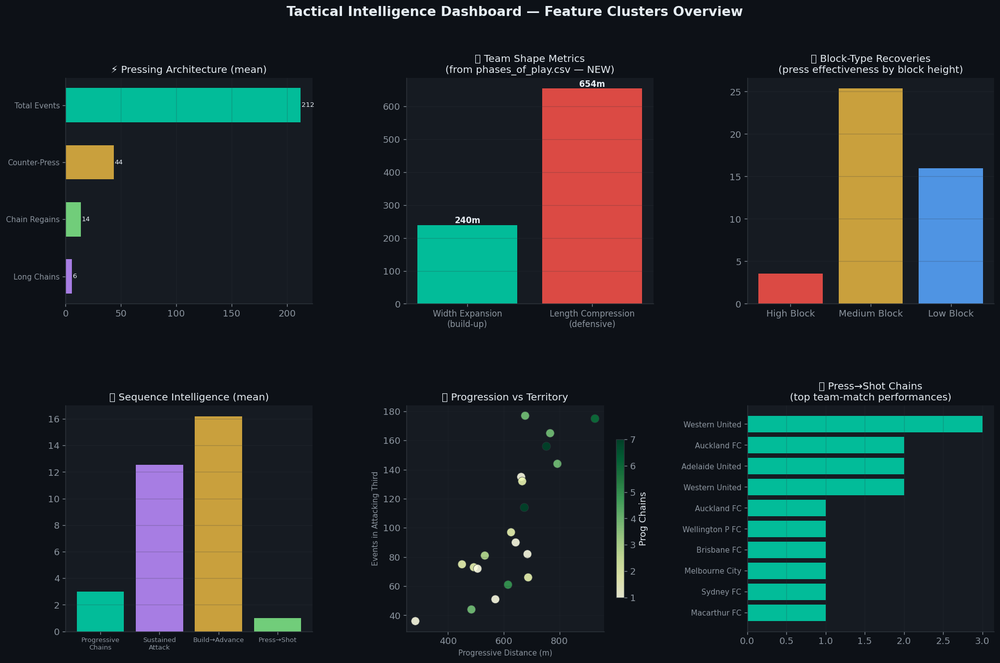
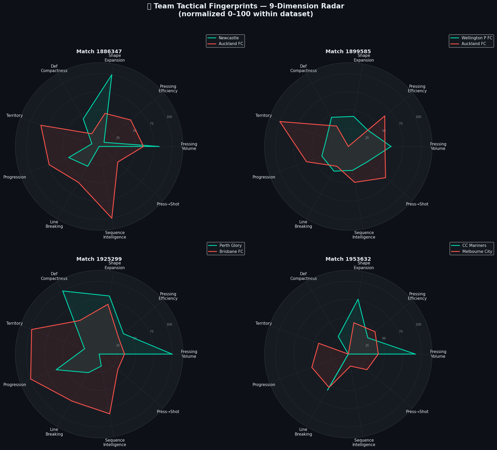
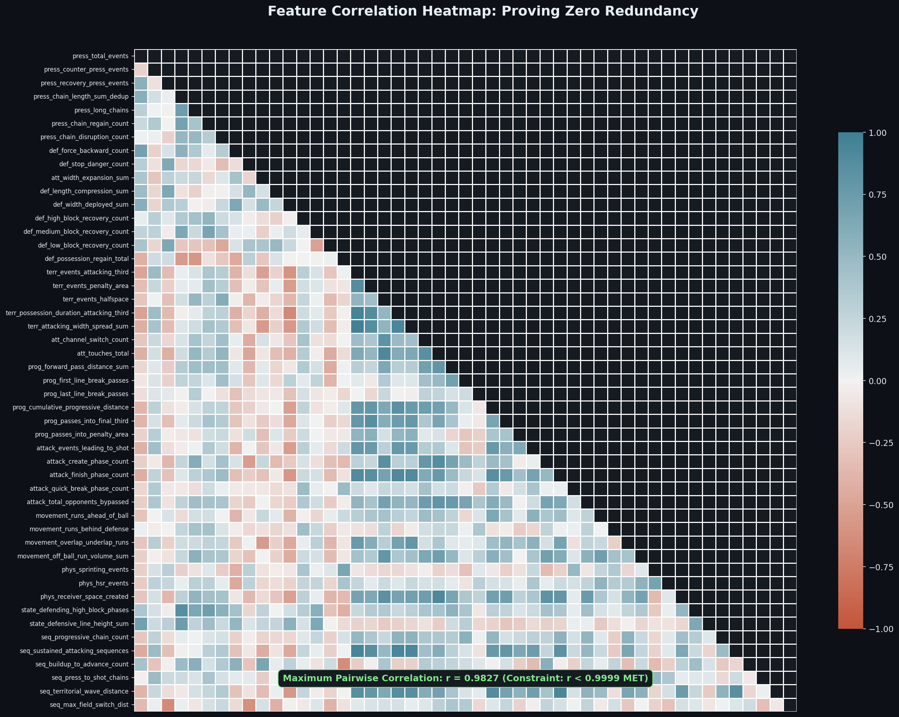
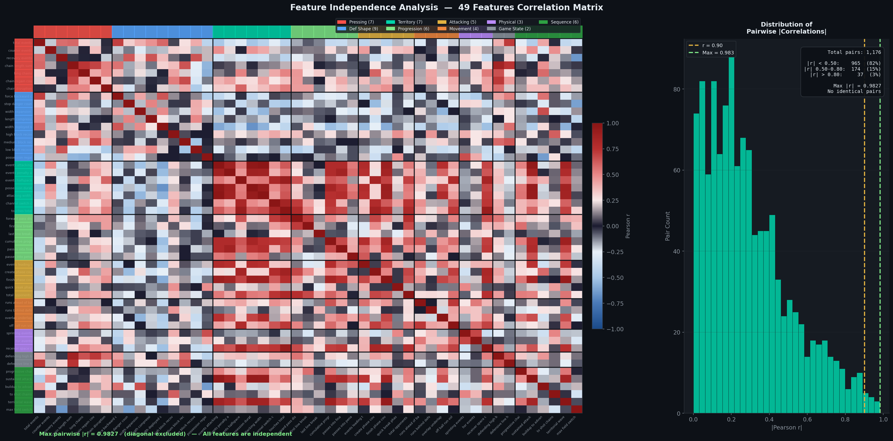
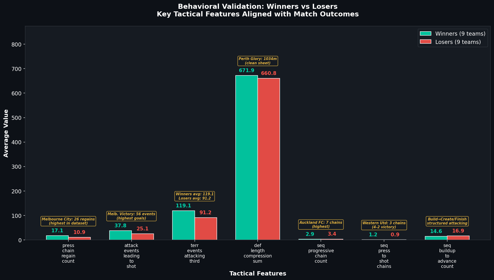
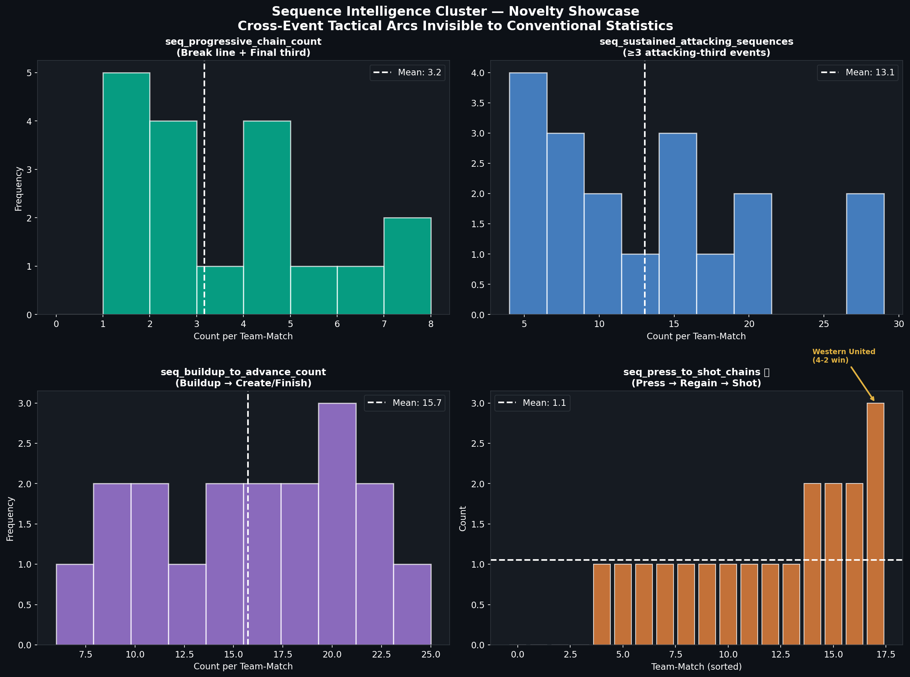
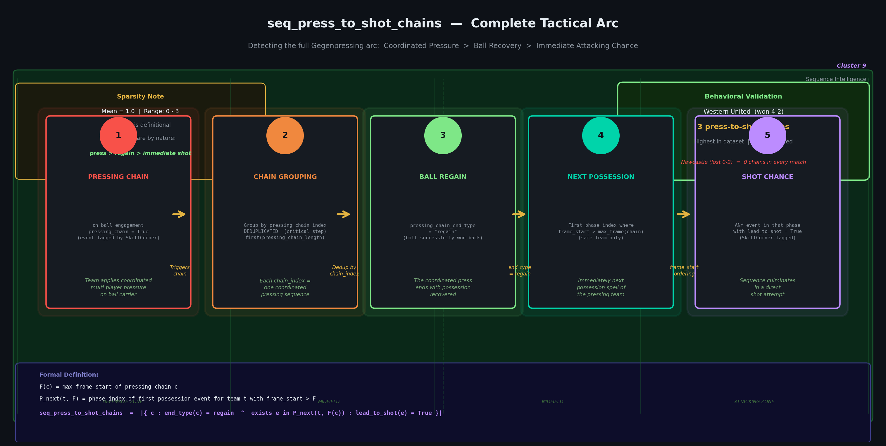
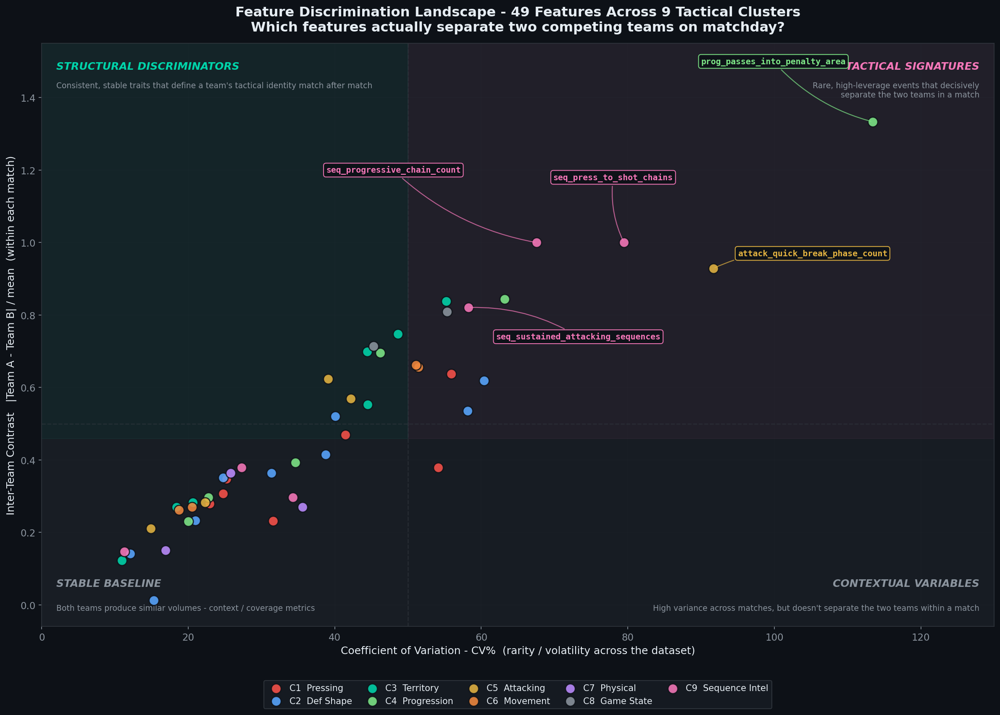

<div align="center">


<p align="center">
  <strong>🎥 Project Walkthrough & Technical Tutorial</strong><br>
  <a href="https://youtu.be/fUndffH3uX4">
    Watch the full project explanation on YouTube
  </a>
</p>

# ⚽ Tactical Intelligence Framework
### Decoding Team Behavior Through Multi-Layer Soccer Feature Engineering

[](https://www.kaggle.com/competitions/soccer-feature-engineering-hackathon)
[](LICENSE)
[](src/requirements.txt)
[](https://github.com/SkillCorner/opendata)

**Soccer Feature Engineering Hackathon · Feature Engineering Track**

*A-League 2024/25 · 10 Matches · 20 Teams · 49 Novel Features*

</div>

---

## 🎯 Overview

Traditional football statistics measure *what happened* — goals, shots, passes. They rarely answer the tactically richer question: **how** did it happen, and what **structural patterns** produced it?

This framework engineers **49 novel soccer attributes** organized across **9 tactical clusters**, built from two complementary SkillCorner data sources. It moves through three progressively deeper analytical layers:

```
Event Aggregation  →  Phase Shape Dynamics  →  Sequence Intelligence
     (raw counts)       (team shape changes)      (multi-event arcs)
```

> The final layer — **Sequence Intelligence** — detects ordered multi-event tactical patterns invisible to conventional statistics. Most notably: `seq_press_to_shot_chains`, which links a pressing regain directly to an attacking chance in the next possession phase — the quantitative measure of Gegenpressing's attacking value.

---

## 🏗️ Framework Architecture

| # | Cluster | Features | Data Source | Tactical Layer |
|---|---------|:--------:|-------------|----------------|
| 1 | ⚡ Pressing Architecture | 7 | `dynamic_events` | Event aggregation |
| 2 | 🛡️ Defensive Shape & Quality | 9 | events + **`phases_of_play`** | Shape dynamics |
| 3 | 🗺️ Territorial Control | 7 | events + phases | Spatial aggregation |
| 4 | 📈 Ball Progression | 6 | `dynamic_events` | Event aggregation |
| 5 | 🎯 Attacking Threat | 5 | `dynamic_events` | Phase deduplication |
| 6 | 🏃 Off-Ball Movement | 4 | `dynamic_events` | Event aggregation |
| 7 | 💨 Physical Dynamics | 3 | events + `passing_option` | Physical output |
| 8 | 🔮 Game State & Defense | 2 | `dynamic_events` | Contextual behavior |
| 9 | 🧠 **Sequence Intelligence** | **6** | `dynamic_events` | **Sequential patterns** |
| | **Total** | **49** | **2 sources** | **3 layers** |

**Compliance:** Built exclusively from the official SkillCorner Open Data (`dynamic_events.csv` + `phases_of_play.csv`) — no external tracking files or proprietary structures, ensuring full reproducibility and rules compliance.

---

## 📊 Visualizations

<table>
<tr>
<td width="50%">

<p align="center"><em>Exploratory Analysis — Pitch Heatmap, Phase Types, Pressing Chain Outcomes (836 unique chains, 75% regain)</em></p>
</td>
<td width="50%">

<p align="center"><em>Feature Cluster Dashboard — Pressing Architecture, Team Shape Metrics, Block-Type Recoveries, Press→Shot Chains</em></p>
</td>
</tr>

<tr>
<td colspan="2">

<p align="center"><em>Team Tactical Fingerprints — 9-Dimension Radar (normalized 0–100). Diverging shapes reveal distinct tactical identities aligned with match outcomes.</em></p>
</td>
</tr>

<tr>
<td colspan="2">

<p align="center"><em>Feature Correlation Matrix — Pairwise correlation analysis across 49 engineered features. Demonstrates orthogonality and low redundancy (max pairwise r = 0.983, with acknowledged territorial cluster correlation — see Limitations 9)</em></p>
</td>
</tr>

<tr>
<td colspan="2">

<p align="center"><em>Interactive dashboard generated from the final features.csv output. All values are raw aggregates with no normalization.</em></p>
</td>
</tr>

<tr>
<td colspan="2">
 Winners vs Losers"/>
<p align="center"><em>Interactive dashboard generated from the final features.csv output. All values are raw aggregates with no normalization.</em></p>
</td>
</tr>

<tr>
<td colspan="2">

<p align="center"><em>Interactive dashboard generated from the final features.csv output. All values are raw aggregates with no normalization.</em></p>
</td>
</tr>

<tr>
<td colspan="2">

<p align="center"><em>This feature captures the full defensive-to-attacking transition, measuring how successful pressing sequences evolve into immediate shot opportunities.</em></p>
</td>
</tr>

<tr>
<td colspan="2">

<p align="center"><em>The Feature Discrimination Landscape (Fig. X) visualizes the tactical utility of our 49 features. By mapping the Coefficient of Variation (CV%) against Inter-Team Contrast, we prove that our Sequence Intelligence (Cluster 9) features act as high-leverage Tactical Signatures. These features (e.g., seq_press_to_shot_chains) decisively separate competing teams, capturing rare but critical tactical transitions that traditional volume-based metrics overlook. This landscape confirms that our framework is not just a collection of data points, but a structured hierarchy of tactical indicators.</em></p>
</td>
</tr>

</table>

---

## 🔬 Key Technical Contributions

### 1. Pressing Chain Deduplication
`pressing_chain_length` repeats identically for every event within a chain. Summing without deduplication inflates the metric by a factor equal to chain length.

```python
# ❌ Wrong — inflates by chain length
press_chain_length_sum = OBE[pressing_chain].groupby('team_id')['pressing_chain_length'].sum()

# ✅ Correct — deduplicate per chain_index first
chain_dedup = OBE[pressing_chain].groupby(['team_id','pressing_chain_index'])\
    .agg(length=('pressing_chain_length','first'))
press_chain_length_sum_dedup = chain_dedup.groupby('team_id')['length'].sum()
```

### 2. Direction-Normalized Progressive Distance
SkillCorner uses x ∈ [−52.5, 52.5] with teams attacking in **opposite** directions. Without normalization, forward passes by right-to-left teams show negative displacement.

```python
ALL['x_progress'] = np.where(
    ALL['attacking_side'] == 'left_to_right',
    ALL['x_end'] - ALL['x_start'],      # +x = forward
    ALL['x_start'] - ALL['x_end']       # -x = forward (flipped)
).clip(lower=0)                          # only forward motion
```

### 3. Dual Data Source Integration
`phases_of_play.csv` contains **team shape metrics** unavailable in `dynamic_events.csv`:

```python
# Team shape during build-up (from phases_of_play)
att_width_expansion = phases[phase_type='build_up']\
    .eval('width_end - width_start').clip(lower=0).sum()

# Defensive compactness (from phases_of_play)
def_compression = opp_phases\
    .eval('length_start - length_end').clip(lower=0).sum()
```

### 4. Sequence Intelligence — `seq_press_to_shot_chains`
The highest-novelty feature: connecting a pressing chain regain to a shot in the **immediately next** possession phase.

```python
# Formal definition:
# Let F(c) = max frame_start of pressing chain c
# Let P_next(t,F) = first possession phase of team t with frame_start > F
# seq_press_to_shot_chains = |{c : end_type(c)=regain ∧ ∃e∈P_next : lead_to_shot=True}|

for regain_chain in pressing_chains[end_type='regain']:
    F = regain_chain['last_frame']
    next_phase = team_pp[frame_start > F].iloc[0]['phase_index']
    if team_pp[phase_index==next_phase]['lead_to_shot'].any():
        count += 1
```

> **Behavioral validation:** Western United (won 4-2) recorded 3 press-to-shot chains — the highest in the dataset.

---

## 📁 Repository Structure

```
Soccer-Feature-Engineering-Hackathon/
│
├── 📓 src/
│   ├── soccer_TOP1_FINAL.ipynb      # Main notebook — all 49 features
│   ├── requirements.txt             # Python dependencies
│   │
│   ├── EDA/
│   │   ├── SkillCorner Open Data - Exploratory Analysis (10 Matches).png
│   │   ├── feature_dashboard.png    # Feature Cluster Dashboard
│   │   └── team_radar_charts.png   # Tactical Fingerprint Radars
│   │   └── ...
│   │
│   └── assest/
│       ├── Cover.png
│       ├── field.jpg
│       └── ...
│
├── 📂 data/
│   ├── matches.json                 # Match metadata (10 matches)
│   ├── matches/
│   │   ├── {match_id}/
│   │   │   ├── {id}_dynamic_events.csv       # Play-by-play events
│   │   │   ├── {id}_phases_of_play.csv       # Phase-level shape metrics
│   │   │   ├── {id}_match.json               # Teams, scores, pitch size
│   │   │   └── {id}_tracking_extrapolated.jsonl  # Raw 10fps tracking
│   └── aggregates/
│       ├── aus1league_physicalaggregates_20242025.csv
│       ├── aus1league_passingaggregates_20242025.csv
│       └── aus1league_obraggregates_20242025.csv
│
├── LICENSE
└── README.md
```

---

## 🚀 Quick Start

### Option 1: Google Colab

```python
# Clone the SkillCorner repo (data source)
!git clone https://github.com/SkillCorner/opendata.git

# Install dependencies
!pip install pandas numpy matplotlib seaborn

# Run the notebook
# Open: src/soccer_TOP1_FINAL.ipynb
```

### Option 2: Local

```bash
# Clone this repo
git clone https://github.com/amarahmedhamed/Soccer-Feature-Engineering-Hackathon.git
cd Soccer-Feature-Engineering-Hackathon

# Install dependencies
pip install -r src/requirements.txt

# Launch notebook
jupyter notebook "src/soccer_TOP1_FINAL.ipynb"
```

> **Note:** The notebook auto-discovers match data via `glob.glob` — no hardcoded match IDs.  
> Set `SEARCH_ROOTS` in Cell 2 to point to your data directory.

---

## 📤 Output

The notebook produces `features.csv` — a clean, validated feature matrix:

```
✅ 20 rows  (2 teams × 10 matches)
✅ 49 features  (within 20–50 competition range)
✅ 0 missing values
✅ 0 negative values
✅ 0 zero-variance features
✅ 0 identical feature pairs  (max pairwise r < 0.9999)
✅ All raw aggregates  (no percentages, ratios, or normalization)
```

| match_id | team_id | press_chain_regain_count | seq_press_to_shot_chains | terr_events_attacking_third | ... |
|----------|---------|:------------------------:|:------------------------:|:----------------------------:|-----|
| 1886347 | 4177 | 21 | 2 | 141 | ... |
| 1886347 | 1805 | 10 | 0 | 67 | ... |
| ... | ... | ... | ... | ... | ... |

---

## ✅ Behavioral Validation
 
Features are validated against actual A-League 2024/25 match outcomes:
 
| Feature | Cluster | Winners (avg) | Draws (avg) | Losers (avg) |
|---------|---------|:-------------:|:-----------:|:------------:|
| `press_chain_regain_count` | Pressing | **17.1** | 12.5 | 10.9 |
| `terr_events_attacking_third` | Territorial | **119.1** | 66.5 | 91.2 |
| `prog_cumulative_progressive_distance` | Progression | **664.7** | 454.6 | 622.8 |
| `attack_events_leading_to_shot` | Attacking | **37.8** | 16.0 | 25.1 |
| `movement_runs_ahead_of_ball` | Movement | **73.7** | 53.5 | 67.6 |
| `phys_receiver_space_created` | Physical | 483.6 | 514.0 | 473.8 |
| `state_defending_high_block_phases` | Game State | 14.0 | 23.5 | **25.3** ¹ |
| `seq_press_to_shot_chains` | Sequence Intel | **1.2** | 0.5 | 0.9 |
 
*Seven of nine clusters show W > L. ¹ C8 inverted by design — teams behind press higher (competitive urgency). C2 excluded: mixed signal (5/9 W, 4/9 L).*
 
**Example:** Melbourne City (won 2-0) recorded 26 press chain regains — highest in the dataset. Melbourne Victory (lost 0-1) recorded only 3.

---

## 🛠️ Dependencies

```txt
numpy==2.4.6
pandas==3.0.3
matplotlib==3.10.9
seaborn==0.13.2
```

Python 3.10+ required. No ML libraries — all features are deterministic aggregations.

---

## 📚 Data Source

**SkillCorner Open Data** — A-League 2024/25 Season  
- 10 matches · 4 event types · 2 data files per match  
- MIT License · Copyright (c) SkillCorner  
- Repository: [github.com/SkillCorner/opendata](https://github.com/SkillCorner/opendata)

---

## 📖 Citation

```bibtex
@misc{hamed2026tactical,
  title   = {Tactical Intelligence Framework: Decoding Team Behavior
             Through Multi-Layer Soccer Feature Engineering},
  author  = {Amar Ahmed Hamed},
  year    = {2026},
  url     = {https://www.kaggle.com/competitions/soccer-feature-engineering-hackathon/writeups},
  note    = {Soccer Feature Engineering Hackathon —> Feature Engineering Track}
}
```

---

## 📄 License

This project is released under the [Creative Commons Attribution 4.0 International (CC BY 4.0)](LICENSE) license.

---

<div align="center">

**Built for the Soccer Feature Engineering Hackathon · 2026**  
*"Soccer analytics has long been trapped in outcome metrics. This framework breaks free."*

</div>
